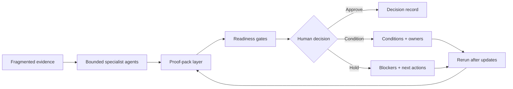

# ApprovalBrief AI Public

**Public materials for ApprovalBrief AI - proof packs for regulated approval decisions.**

ApprovalBrief AI helps regulated teams prepare review-ready proof packs before high-stakes approval decisions.

It is designed for workflows where evidence is scattered, review expectations differ across teams, and the final decision must remain human-owned and defensible.

---

## Core principle

> **Bounded specialist AI agents prepare proof artifacts.**  
> **Deterministic readiness gates structure the decision state.**  
> **Humans approve, condition, hold, or escalate.**

ApprovalBrief AI is not an autonomous approval system.

It is a controlled evidence-to-decision layer for regulated workflows.

---

## Where it applies

Initial public focus areas:

- payment pilot and rollout readiness
- vendor / ICT third-party risk approval
- internal AI tool approval
- regulated enterprise change gates

These are different buyer doors, but the underlying problem is similar: teams need clearer evidence, ownership, reviewer context, and decision memory before approving a controlled change.

---

## High-level model

---

## What a proof pack supports

A proof pack is intended to help teams answer:

- What decision is being requested?
- What evidence supports the case?
- What is missing, unclear, or blocked?
- Who owns the next action?
- Which reviewers need context?
- What changed since the last review?
- What decision was made, and under which conditions?

The exact internal methods, agent roles, mappings, templates, and orchestration logic are private.

---

## Public / private boundary

This repository is intentionally limited to public-safe material.

Public materials may include:

- concept notes
- synthetic examples
- high-level diagrams
- validation framing
- non-sensitive product explanations

Public materials do **not** include:

- private product implementation
- proprietary orchestration logic
- real customer evidence
- internal mappings
- sensitive templates
- regulated case material
- detailed reviewer-lane logic
- design-partner-specific workflows
- bounded-agent task design
- readiness-gate implementation details

---

## Current stage

ApprovalBrief AI is currently in prototype and design-partner discovery.

The next validation step is shadow-mode testing with synthetic, redacted, or approved case material.

The goal is to test whether proof packs improve reviewability, ownership clarity, evidence traceability, and decision confidence before deeper enterprise integration.

---

## Contact

For design-partner conversations, regulated approval workflows, or thesis-related exchange, please connect via LinkedIn.
